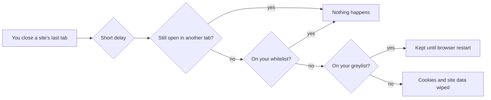

# Introduction

Auto-Delete Cookies for Privacy (ADCP) is a browser extension for Chrome, Brave, and other Chromium-based browsers. It does one job: when you close a site's last tab, it wipes the traces that site left in your browser — unless you've told it that site is one you want to keep.

## Why bother?

Almost every site you visit stores something in your browser. Some of it is useful to you: the cookie that keeps you logged in to your email, the one that remembers your dark-mode preference. Most of it is useful to someone else: identifiers that recognize you when you come back, that follow you from site to site, that quietly rebuild a profile of what you read and buy.

Browsers offer two blunt options: keep everything (the default) or clear everything (and get logged out of every site you use). ADCP gives you the option in between — **keep the sites you choose, forget everybody else, automatically.**

## The mental model

Everything in ADCP follows from three ideas:

1. **Cleanup happens when you close a site.** Not on a timer, not while you're using the site. You close the last tab a site has open, a short delay passes, and then its cookies (and optionally other stored data) are removed. Sites you keep open are always left alone.

2. **Keep lists protect the sites you care about.** You put a site on the **whitelist** and its cookies survive everything. You put it on the **greylist** and its cookies survive until you restart the browser — good for "log me in for today, but don't remember me tomorrow."

3. **Everything else is forgotten.** Any site on neither list gets cleaned after you leave it. You don't have to name your enemies — you only name your friends.

## What it can clean

Cookies are the core, but sites have other places to stash data. ADCP can optionally clean these too, per site, using the same keep-list rules:

- **LocalStorage** and **IndexedDB** — general-purpose storage sites use for anything from preferences to tracking
- **Cache** — stored copies of pages and images
- **Service workers** — background scripts a site leaves installed
- **Plugin data**

## What it never does

ADCP never sends anything anywhere. It has no server, no analytics, no accounts. All your settings and lists live inside your browser, and the extension's only network activity is none at all. The [Privacy Policy](https://github.com/j127/auto_delete_cookies_for_privacy/blob/main/PRIVACY.md) spells this out permission by permission.
